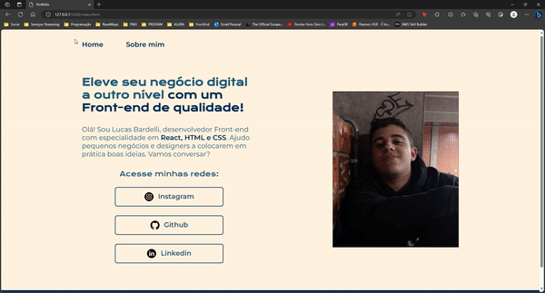

<h1 align="center">Meu primeiro portfólio</h1>
Projeto onde obtive conhecimentos essenciais que me permitem aprimorar minhas habilidades como desenvolvedor web. Aprofundei meus conhecimentos na técnica do Flexbox, assim, posso posicionar elementos de forma prática e eficaz, proporcionando layouts mais flexíveis e dinâmicos às minhas páginas. Além disso, aprendi a dominar a estilização de textos, fontes e ícones, o que torna minha capacidade de criar designs atraentes e coesos para minha página web.

##

  

##

<h2>Linguagens & Softwares utilizados:</h2>

